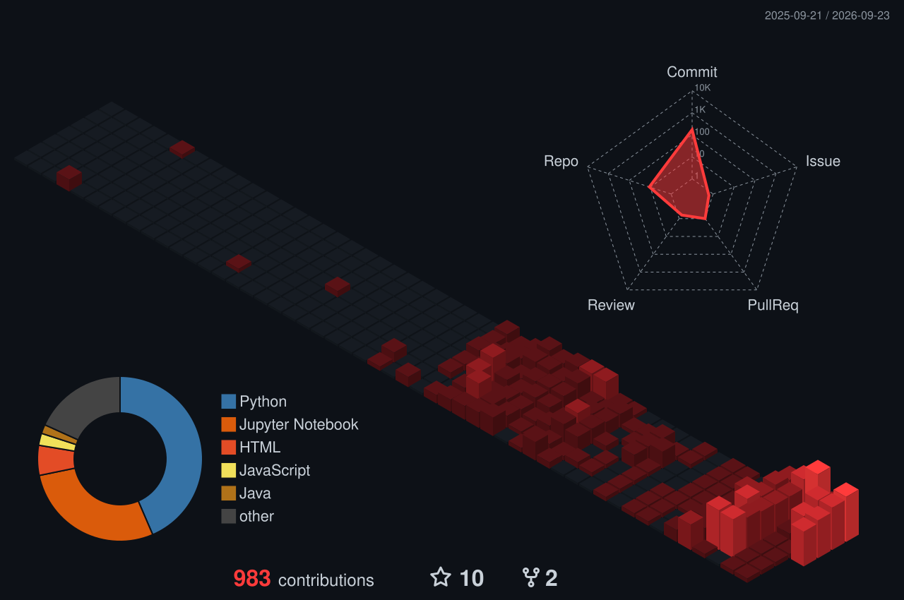

<div align="center">


<a href="https://git.io/typing-svg">
  
</a>

<br/><br/>

[](YOUR_PORTFOLIO_URL)
[](https://www.linkedin.com/in/chukka-bhanu-prakash)
[](mailto:bhanuchukka2005@gmail.com)
[](https://leetcode.com/u/Bhanu_heroo7)

</div>

<br/>

### 🔴 `./status --verbose`

```bash
[ OK ] Unit ......... Chukka Bhanu Prakash
[ OK ] Base ......... Presidency University, Bengaluru
[ OK ] Program ...... B.Tech CSE · CGPA 9.16
[ OK ] Focus ........ AI/ML · Backend · DevOps
[ OK ] LeetCode ..... 100+ problems solved
[ OK ] Portfolio .... online (3D · robotic · red)
```

<br/>

### 🤖 `cd ./portfolio`

<div align="center">

**A 3D robot-themed portfolio, built to be explored rather than scrolled.**

[](YOUR_PORTFOLIO_URL)

<!-- Optional: add a screen-recording GIF of the robot here, then uncomment:

-->

</div>

<br/>

### 🧠 `stack --list`

<div align="center">

**💻 Programming**<br/>


<br/>

**🤖 AI / ML**<br/>


`Machine Learning` · `NLP` · `Generative AI` · `LLMs` · `Prompt Engineering` · `AI Agents / Agentic AI` · `RAG` · `Semantic Search` · `Knowledge Graphs` · `Model Evaluation`

<br/>

**⚙️ Backend**<br/>


`REST APIs` · `API Integration` · `Backend Architecture` · `JSON` · `HTTP`

<br/>

**🗄️ Databases**<br/>


<br/>

**☁️ DevOps / Cloud**<br/>


`CI/CD`

<br/>

**📊 Data / ML Tools**<br/>


`TextBlob` · `VADER`

<br/>

**🛠️ Developer Tools**<br/>


<br/>

**🧬 Core CS**<br/>

`Data Structures & Algorithms` · `Object-Oriented Programming` · `Operating Systems` · `Computer Networks` · `DBMS` · `System Calls` · `Computer Architecture`

</div>

<br/>

### 🏆 `git log --grep achievements`

- 🥉 **3rd Place** — DevOps Decode, Presidency University (2026)
- ⚡ **FusionX Hackathon 2026** — built VoiceGuard end-to-end in 24 hrs · Track 3: AIML
- 🧩 **LeetCode** — [100+ problems solved](https://leetcode.com/u/Bhanu_heroo7)

<br/>

### 🧊 `render --contributions --3d`

<div align="center">



<br/>


</div>

<br/>

### 🔋 `whoami --currently`

```bash
$ tail -f now.log
> Built a 3D robot portfolio with a red theme
> Deepening AI/ML, backend engineering, and DevOps
> Exploring RAG, agents, and secure cloud infrastructure
```

<br/>

### 📬 `connect --channels`

<div align="center">

[](mailto:bhanuchukka2005@gmail.com)
[](https://www.linkedin.com/in/chukka-bhanu-prakash)
[](https://leetcode.com/u/Bhanu_heroo7)

</div>


